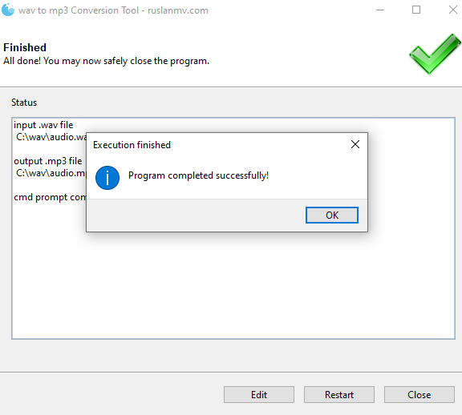

## How to convert Wav To Mp3 Python

Converting wav to mp3 format looks difficult to do but thanks to python libraries. 

So in order to convert Wav to Mp3 in python, we will use the pydub python library. **[Pydub](https://pypi.org/project/pydub/)** is an audio library which is used to manipulate audio in a simple and easy high level interface.

### Install and setup python

Our first step is to install and set up python on your computer. You can skip this if you have python installed on your computer. You can download python from the **[official python website](https://www.python.org/downloads/)**.

You may use **libav or ffmpeg**.

Mac (using [homebrew](http://brew.sh/)):

```
# ffmpeg
brew install ffmpeg
```

Linux (using aptitude):

```
# ffmpeg
apt-get install ffmpeg libavcodec-extra
```

```python
pip install pydub
```

The above command will install pydub in your project. It is a very small library. It should install it quickly after installing, create a python file and get ready to write some code.

# Pydub  method


### Copy and paste the wav to mp3 python code.

```python
from os import path
from pydub import AudioSegment
from pathlib import Path
from gooey import Gooey, GooeyParser


@Gooey(dump_build_config=False, program_name="wav to mp3 Conversion Tool")
def main():
    desc = "A Python GUI App to convert a .wav and  into a .mp3"
    wav_select_help_msg = "Select a .wave audio file to process"

    my_parser = GooeyParser(description=desc)
    my_parser.add_argument(
        "wav_to_convert", help=wav_select_help_msg, widget="FileChooser"
    )

    my_parser.add_argument(
        "output_dir", help="Directory to save output mp3", widget="DirChooser"
    )

    args = my_parser.parse_args()

    # construct the .wav input audio file path
    wav_to_convert_Path = Path(args.wav_to_convert)

    mp3_outfile_name = str(wav_to_convert_Path.stem) + ".mp3"
    mp3_outfile_Path = Path(args.output_dir, mp3_outfile_name)
    mp3_outfile_Path.unlink(missing_ok=True) # delete the .mp3 file if it's there


    print(f"input .wav file \n {wav_to_convert_Path}")
    print()
    print(f"output .mp3 file \n {mp3_outfile_Path}")
    print()

    #convert wav to mp3
    sound = AudioSegment.from_mp3(wav_to_convert_Path)
    sound.export(mp3_outfile_Path, format="wav")


    print("Converted Successfully")
    print()


if __name__ == "__main__":
      main()


```


to run the program just type


```
python wav_to_mp3.py
```


and you will see


you select the .wav file that you wants to convert to mp3


and  you click start





# ffmpeg method


Here I will use the following command

```
 ffmpeg -i input.wav -vn -ar 44100 -ac 2 -b:a 192k output.mp3
```

where the arguments in this example:

- `-i` - input file
- `-vn` - Disable video, to make sure no video (including album cover image) is included if the source would be a video file
- `-ar` - Set the audio sampling frequency. For output streams it is set by default to the frequency of the corresponding input stream. For input streams this option only makes sense for audio grabbing devices and raw demuxers and is mapped to the corresponding demuxer options.
- `-ac` - Set the number of audio channels. For output streams it is set by default to the number of input audio channels. For input streams this option only makes sense for audio grabbing devices and raw demuxers and is mapped to the corresponding demuxer options. So used here to make sure it is stereo (2 channels)
- `-b:a` - Converts the audio bitrate to be exact 192kbit per second


### Copy and paste the wav to mp3 python code.

```python
from os import path
#from pydub import AudioSegment
from pathlib import Path
from gooey import Gooey, GooeyParser
import subprocess
import platform

@Gooey(dump_build_config=False, program_name="wav to mp3 Conversion Tool - ruslanmv.com")
def main():
    desc = "A Python GUI App to convert a .wav and  into a .mp3"
    wav_select_help_msg = "Select a .wav audio file to process"

    my_parser = GooeyParser(description=desc)
    my_parser.add_argument(
        "wav_to_convert", help=wav_select_help_msg, widget="FileChooser"
    )

    my_parser.add_argument(
        "output_dir", help="Directory to save output mp3", widget="DirChooser"
    )

    args = my_parser.parse_args()

    # construct the .wav input audio file path
    wav_to_convert_Path = Path(args.wav_to_convert)

    mp3_outfile_name = str(wav_to_convert_Path.stem) + ".mp3"
    mp3_outfile_Path = Path(args.output_dir, mp3_outfile_name)
    mp3_outfile_Path.unlink(missing_ok=True) # delete the .mp3 file if it's there


    print(f"input .wav file \n {wav_to_convert_Path}")
    print()
    print(f"output .mp3 file \n {mp3_outfile_Path}")
    print()
    
    
    #read wav file to an audio-segment
    #song = AudioSegment.from_wav(wav_to_convert_Path) #your_wave_file.wav

    #export audio segment to mp3
    #song.export(mp3_outfile_Path, format="mp3")  #your_wave_file.mp3

    #play audio-segment
    #play(song)
    
    
    # Determine ffmpeg executable file path
    """
    where ffmpeg
    """
    if platform.system() == 'Windows':

        ffmpeg_path_bytes = subprocess.check_output("where ffmpeg", shell=True) 
        
    elif platform.system() == 'Linux':
        ffmpeg_path_bytes = subprocess.check_output("which ffmpeg", shell=True) 

    ffmpeg_executable_path = ffmpeg_path_bytes.decode().strip()
    print("ffmpeg_executable_path: ", ffmpeg_executable_path)
    
    '''
    ffmpeg -i input.wav -vn -ar 44100 -ac 2 -b:a 192k output.mp3
    '''
    
    # create the ffmpeg command
 
    aux = '-vn -ar 44100 -ac 2 -b:a 192k'
    
    ffmpeg_command = f"-i {wav_to_convert_Path} {aux} {mp3_outfile_Path}"
    cmd_command = f"{ffmpeg_executable_path} {ffmpeg_command}"
    
    
    # call ffmpeg
    returned_value = subprocess.call(cmd_command, shell=True)# returns the exit code in unix
    
    print("returned value:", returned_value)
    
    
   
if __name__ == "__main__":
      main()

```


**Congratulations!** We have learned how to converting wav to mp3 in python programming.